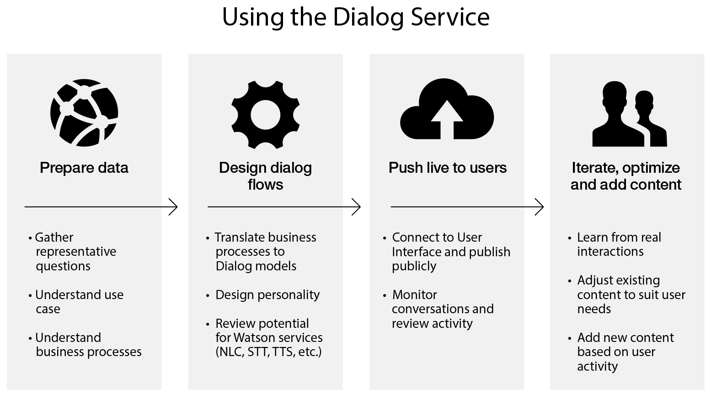

---

copyright:
  years: 2015, 2017
lastupdated: "2017-08-15"

---

{:shortdesc: .shortdesc}
{:new_window: target="_blank"}
{:tip: .tip}
{:pre: .pre}
{:codeblock: .codeblock}
{:screen: .screen}
{:javascript: .ph data-hd-programlang='javascript'}
{:java: .ph data-hd-programlang='java'}
{:python: .ph data-hd-programlang='python'}
{:swift: .ph data-hd-programlang='swift'}
{:note: .deprecated}

# About

**The {{site.data.keyword.dialogfull}} service is depecated.** *It is no longer pssible to create new instances of the service. Existing service instances will continue to be supported until **August 9, 2017**. Users of the {{site.data.keyword.dialogshort}} service should migrate their applications to use the {{site.data.keyword.conversationfull}} service. See the documentation for the [Conversation service ](https://console.stage1.bluemix.net/docs/services/conversation/index.html){: new_window} to learn how to migrate your dialogs to that service.*
{: deprecated}

The {{site.data.keyword.dialogshort}} service provides a comprehensive, robust, platform for managing conversations between virtual agents and users through an application programming interface (API). These conversations are commonly referred to as **dialogs**.
{: shortdesc}

{{site.data.keyword.dialogshort}}s are created by using the REST API for the {{site.data.keyword.dialogshort}} service or by calling the functions in the client-side libraries for {{site.data.keyword.watson}} Developer Cloud applications in [Node.js ](https://github.com/watson-developer-cloud/nodejs-wrapper){: new_window} and [Java ](https://github.com/watson-developer-cloud/java-wrapper){: new_window}.

The {{site.data.keyword.dialogshort}} service can manage 1 - 100 dialogs. {{site.data.keyword.dialogshort}} XML files can contain as many lines as necessary, but they are limited to 200 MB.

## How to use the service
{: #overview_howtouse}

The following image shows the process for using the {{site.data.keyword.dialogshort}} service.

## Use cases
{: #overview_uses}

You can create dialogs for virtual agent applications. With dialogs, humans and virtual agents can have natural, free-flowing, and human-like conversations.

Virtual agent applications that use dialogs that are created by the {{site.data.keyword.dialogshort}} service can assist users in the following ways:

-   Engage in personalized, context-aware interactions
-   Answer questions
-   Provide product suggestions and decision support
-   Perform tasks and make transactions
-   Drive a user through a step-by-step process
-   Disambiguate inquiries
-   Connect with external systems
-   Show personality and have humanized interaction
-   Navigate users through websites and provide links
-   Provide interactive problem resolution

## Benefits
{: #overview_benefits}

The service has the following benefits:

-   The {{site.data.keyword.dialogshort}} service provides a simple, guided experience for users to quickly achieve goals without human help.
-   The {{site.data.keyword.dialogshort}} service is easy to use. It's available through an API, so you can focus on your own business logic and application code.
-   Because the service is hosted by {{site.data.keyword.IBM_notm}}, you can immediately take advantage of every improvement that we make. And the scalable {{site.data.keyword.IBM_notm}} infrastructure removes the need for you to staff your own highly available data center.

## Sample applications
{: #overview_sample}

The following sample application uses the service:

-   [Node.js code ](https://github.com/watson-developer-cloud/dialog-nodejs){: new_window} on GitHub for a sample {{site.data.keyword.dialogshort}} application. This application requires a separate dialog definition, which you can create by using the [{{site.data.keyword.dialogshort}} tool ](https://github.com/watson-developer-cloud/dialog-tool){: new_window}.
